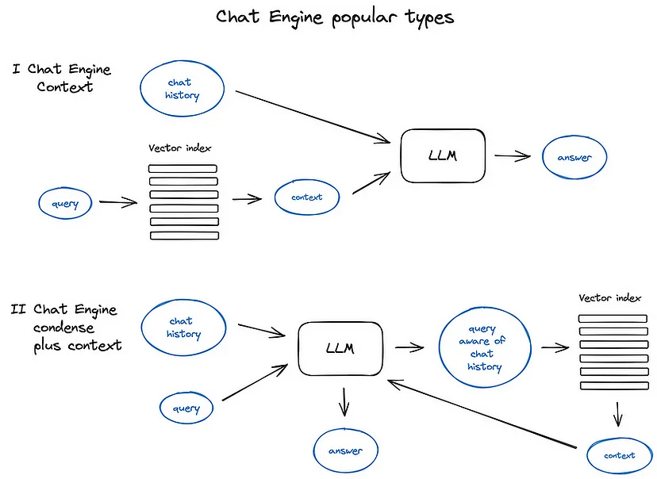

# Video 

([Video](https://drive.google.com/file/d/1KD7NAasHvx6TV3M7kFu4LqZI4Zi4Q-2q/view?usp=sharing))

# Converted HTML Notes to PDF

Downloaded all the notes form the notion
Notion doesnot provide a way to directly download the notes in pdf so i downloaded first in html
Converted all the html files to pdf
([Refrence Link](https://www.javatpoint.com/converting-html-to-pdf-files-using-python))

# Chunking the documents 

# Vectorzing the documents

([Choose best Embedding model ](https://huggingface.co/blog/mteb))

[Refrence Link](https://medium.com/@krtarunsingh/advanced-rag-techniques-unlocking-the-next-level-040c205b95bc)

# Storing into vector databases

store and retrieve vectorized content efficiently.
The most straightforward approach utilizes a flat index, performing brute-force searches across all vectors. However, for larger scales, more sophisticated indices like FAISS, NMSLIB, or Annoy are employed, using Approximate Nearest Neighbours techniques for faster retrieval. Managed solutions like OpenSearch or ElasticSearch, and vector databases such as Pinecone and Weaviate, also play a role by simplifying data management.

Some techniques 
<!--  -->
For extensive document collections, a hierarchical indexing system can significantly enhance search efficiency. This method involves creating a two-tiered system: one index for document summaries and another for detailed chunks. By filtering through summaries first, the search process becomes more targeted, focusing only on relevant documents in the subsequent, more detailed search step

2.3 Hypothetical Questions and the HyDE Approach:
A novel approach involves the generation of hypothetical questions for each text chunk. These questions are then vectorized and stored, replacing the traditional text vectors in the index. This method enhances semantic alignment between user queries and stored data, potentially leading to more accurate retrievals. The HyDE method reverses this process by generating hypothetical responses to queries, using these as additional data points to refine search accuracy.

This technique enhances search precision by embedding individual sentences and extending the search context to include neighboring sentences. This not only improves the relevance of the retrieved data but also provides the LLM with a richer context for generating responses.

Similar to the Sentence Window Retrieval, this method focuses on granularity but extends the context more broadly. Documents are segmented into a hierarchy of chunks, and smaller, more relevant pieces are initially retrieved. If multiple small chunks relate to a larger segment, they are merged to form a comprehensive context, which is then presented to the LLM.

# Retrieving 
Reranking and Filtering: Enhancing Retrieval Precision
After the initial retrieval of results using any of the aforementioned sophisticated algorithms, the focus shifts to refining these results through various post-processing techniques. In systems like LlamaIndex, a plethora of Postprocessors are available, enabling the fine-tuning of retrieval outcomes based on similarity scores, keywords, metadata, or through re-ranking with additional models . Can you a different LLM

 Sub-query Decomposition : Query transformation techniques utilize LLMs to alter or refine user inputs, thereby improving the quality and relevance of information retrieval. These transformations can take various forms:
an LLM can break down the query into simpler, more manageable sub-queries. Each sub-query can then be processed independently, with their results synthesized later to form a comprehensive response. Both LangChain and LlamaIndex feature tools like Multi Query Retriever and Sub Question Query Engine to facilitate this process.

Step-back Prompting: This method involves using an LLM to generate a broader or more general query from the original, complex query. The aim is to retrieve a higher-level context that can serve as a foundation for answering the more specific original query. The contexts from both the original and the generalized queries are then combined to enhance the final answer generation.

# Synthesising the Response
Response Synthesizer: Crafting the Final Answer :
The culmination of any RAG pipeline is the synthesis of a response based on the retrieved context and the initial user query. The simplest method might involve merely concatenating all relevant context with the query and processing it through an LLM. However, more nuanced approaches involve multiple LLM interactions to refine the context and enhance the quality of the final answer. These approaches include:
1. Iterative Refinement: Breaking down the retrieved context into manageable chunks and sequentially refining the response through multiple LLM interactions.
2. Context Summarization: Compressing the extensive retrieved context to fit within an LLM’s prompt limitations.
3. Multi-Answer Generation: Producing several responses from different context segments and then synthesizing these into a unified answer.

# Advanced techniques 
Chat Engine: Enhancing Dialogue Capabilities in RAG Systems

- ContextChatEngine: A straightforward approach where the LLM retrieves context relevant to the user’s query along with any previous chat history. This history is then used to inform the LLM’s response, ensuring continuity and relevance in the dialogue.

CondensePlusContextMode: A more advanced technique where each interaction’s chat history and the last message are condensed into a new query. This refined query is used to retrieve relevant context, which, along with the original user message, is passed to the LLM for generating a response.

Good Technique to verify whether the retrieve answer is relevant or not :
LLM and Encoder Fine-Tuning
Further refining response quality involves fine-tuning the deep learning models used in the RAG pipeline, such as the Transformer Encoder or the LLM itself. The Transformer Encoder, responsible for the quality of context retrieval, and the LLM, tasked with utilizing the context to generate responses, can both benefit from fine-tuning:

- Encoder Fine-Tuning: Despite the high efficiency of modern Transformer Encoders, fine-tuning can still yield modest improvements in retrieval quality, especially when tailored to specific domains.
- Ranker Fine-Tuning: Employing a cross-encoder for re-ranking can refine the selection of context, ensuring that only the most relevant text chunks are considered.
- LLM Fine-Tuning: The advent of LLM fine-tuning APIs allows for the adaptation of models to specific datasets or tasks, enhancing their effectiveness and accuracy in generating responses.

Models Available

Pipeline 

Resources 
[Mistral Embeddings](https://docs.mistral.ai/capabilities/embeddings/)

[Notebook Refrence](https://github.com/mrdbourke/simple-local-rag/blob/main/00-simple-local-rag.ipynb)

